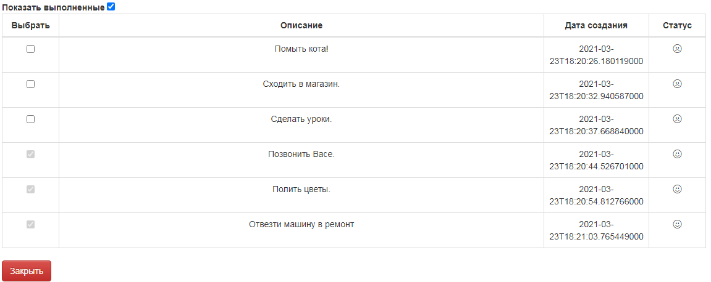
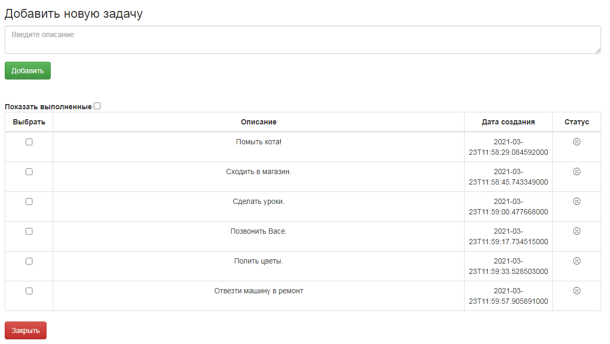
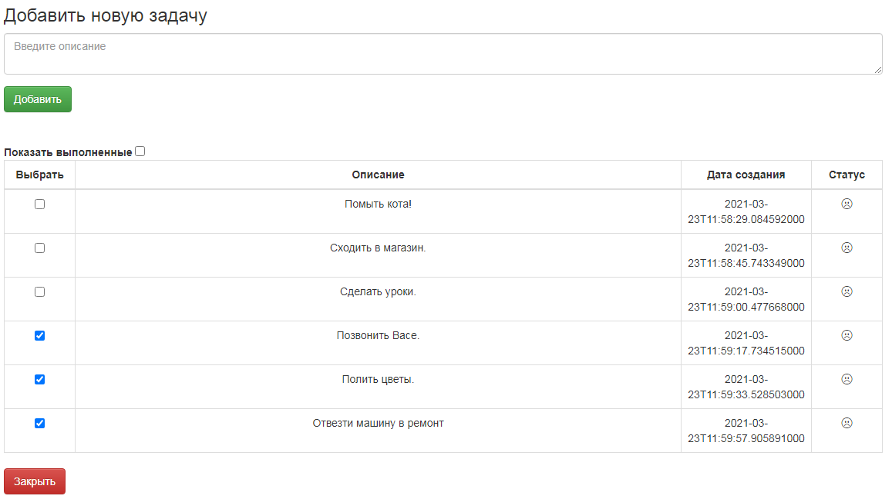
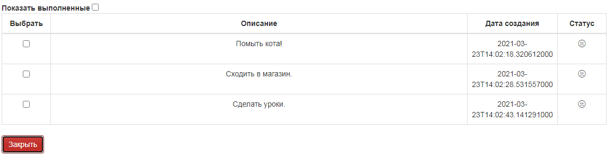

# job4j_todo

## О проекте
Сервис todo list. Позволяет пользователям вести список заданий.

## Стек
* Back-end
  * Java 15
  * Java EE Servlets
  * Hibernate, Postgres
  * Tomcat
  * Maven
  * Travis Ci
    
* Front-end
  * JS, Ajax
  * HTML5    
  * Bootstrap
    
## Возможности

* Авторизация/регистрация пользователей
* Добавление заданий в список с указанием категории.
* Возможность закрыть несколько задач.
* Фильтр для отображения ожидающих выполнения/выполненных задач.

## Демо
ToDo List

Авторизация

Регистрация

Главная страница

## Контакты
Если у вас остались вопросы, вы можете связаться со мной.
* Telegram: @vbgrishin